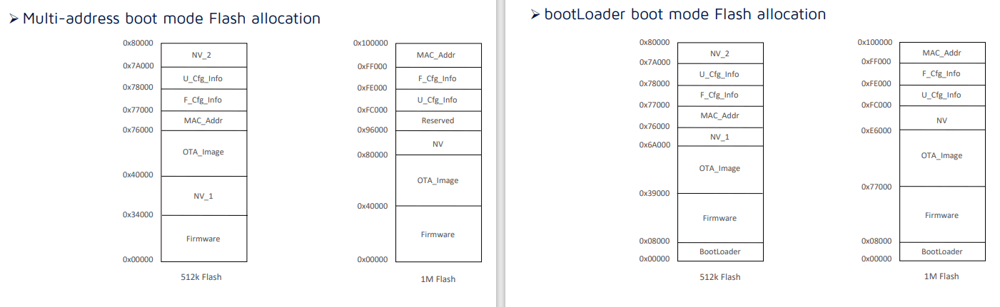
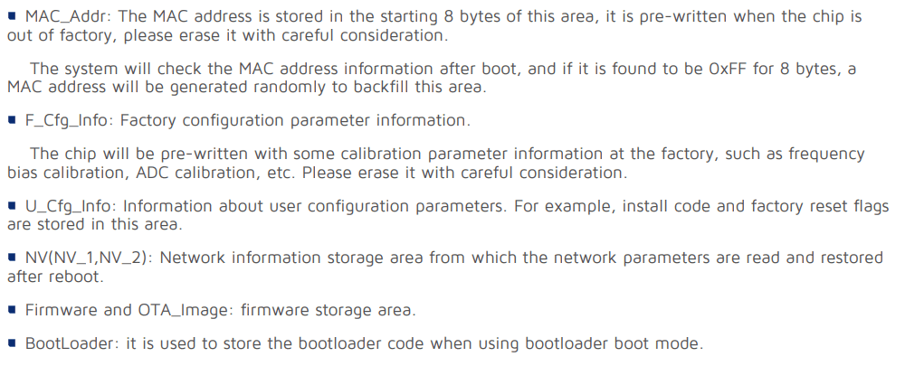

# Telink Zigbee serial flash tool

> [!WARNING]  
> This project is not thoroughly tested yet!

Reliably read, write and erase flash memory for Telink Zigbee boards (eg. TLSR8258) with just a USB-to-serial converter.

```
D:\Progetti\tuyaZigbee\Telink Zigbee serial flash tool>Telink_Tools.py 
Telink_Tools.py v0.2 dev Suxsem
usage: Telink_Tools.py [-h] [--port PORT] {write_flash,read_flash,erase_flash} ...

Telink_Tools.py v0.2 dev Suxsem - Telink Zigbee serial flash tool - edit by Suxsem

positional arguments:
  {write_flash,read_flash,erase_flash}
                        Run Telink_Tools.py -h for additional help
    write_flash         Write data to flash
    read_flash          Read flash
    erase_flash         erase 4K (a sector)

options:
  -h, --help            show this help message and exit
  --port, -p PORT       Serial port device

```
## Connections

<picture>
    <source media="(prefers-color-scheme: dark)" srcset="./docs/diagram_dark.png" />
    <source media="(prefers-color-scheme: light)" srcset="./docs/diagram.png" />
    
</picture>


## Usage

Clone or download the repository and execute Telink_Tools.py in a system with Python installed.

## Examples

### Backup entire flash

1 MB flash

    Telink_Tools.py -p COM3 read_flash 0 1048576 dump.bin

512 KB flash

    Telink_Tools.py -p COM3 read_flash 0 524288 dump.bin

### Erase first 3 flash sectors (aka 12 KB. 1 sector = 4 KB)

    Telink_Tools.py -p COM3 erase_flash 0 3

### Burn firmware at address 0

> Please note that flash must be erased before write. You need to compute the number of minimum sectors to be erased remembering that 1 sector = 4 KB.
	
	Telink_Tools.py -p COM3 erase_flash 0 31	
    Telink_Tools.py -p COM3 write_flash 0 motionSensor_TS0202.bin

## Flash layout

<picture>
    <source media="(prefers-color-scheme: dark)" srcset="./docs/flash_allocation_dark.PNG" />
    <source media="(prefers-color-scheme: light)" srcset="./docs/flash_allocation.PNG" />
    
</picture>
<picture>
    <source media="(prefers-color-scheme: dark)" srcset="./docs/flash_description_dark.PNG" />
    <source media="(prefers-color-scheme: light)" srcset="./docs/flash_description.PNG" />
    
</picture>

## Credits

https://github.com/Ai-Thinker-Open/TBXX_Flash_Tool
https://github.com/Ai-Thinker-Open/Telink_825X_SDK/tree/master/example/bootloader
https://github.com/pvvx/TlsrComProg825x